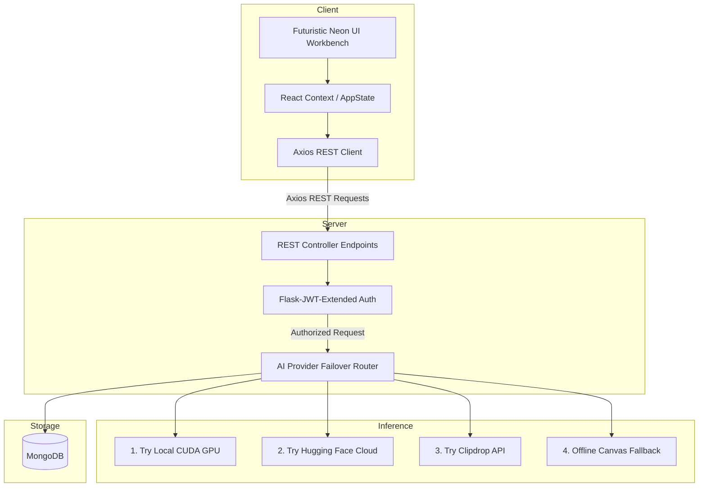

# 🎨 PictoAI — AI-Powered Art Generation Platform

<p align="center">
  
  
  
  
  
</p>

### 📝 Repository Description
**PictoAI** is an AI-powered image generation platform built with React, Flask, Stable Diffusion, JWT authentication, MongoDB, and multi-provider inference pipelines. It features a futuristic neon UI workbench, prompt-matching md5 response caching, and a robust failover routing system designed for high availability through multi-provider failover.

---

## 🔗 Project Demo & Links

* **Live Frontend Demo**: *(Insert your live URL here if deployed, or launch local sandbox mode)*
* **Video Demonstration**: [Watch the walkthrough on YouTube](https://youtube.com) *(Insert your screen-recording URL)*
* **API Reference**: Read the [REST API Documentation](#-rest-api-documentation) section.

---

## ⚖️ Feature Summary & Comparison

| Feature | Supported | Description |
| :--- | :---: | :--- |
| **Stable Diffusion Generation** | ✅ | Native text-to-image synthesis using diffusion pipelines. |
| **Multi-Provider Fallback** | ✅ | Automated failovers across local CUDA and cloud serverless providers. |
| **JWT Authorization** | ✅ | Secure user sessions, password salting (bcrypt), and credit limits. |
| **Prompt Metadata Caching** | ✅ | MD5 checking to serve duplicate prompt designs almost instantly. |
| **Razorpay Checkout Integration** | ✅ | Secure web store integration for purchasing subscription credit top-ups. |
| **Backend Integration Tests** | ✅ | Full end-to-end endpoint regression suite validation. |
| **Local Sandbox Fail-Safe** | ✅ | Auto-detects DB presence to run without MongoDB setups. |

---

## 📸 Application Interface Showcase

### 🌟 Workspace Page (Generated State)


### ⚙️ Workbench Page (Empty State)


### 🏠 Landing Page


---

## 🧠 System Architecture Diagram



---

## 📊 Core Performance Metrics & Highlights

* **4 Fallback Tiers**: AI router provides uninterrupted generation using Local CUDA ➔ Hugging Face API ➔ Clipdrop API ➔ Offline Canvas drawer.
* **Metadata Prompt Caching**: Checks MD5 query parameter hashes to serve cached images almost instantly, skipping redundant GPU compute.
* **JWT-Based Session Security**: Standard bcrypt salt-hashing with secure bearer access tokens for credit protection.
* **Instant Sandbox Mode**: Detects database availability and automatically boots into offline Demo Mode if MongoDB is offline.

---

## 📂 Backend Architecture & File System

The backend is structured into modular layers adhering to standard MVC design principles:

* **[app.py](file:///d:/Project/PICTOAI-main/server/app.py)**: Central entrypoint initializing Flask, Flask-JWT-Extended, CORS, configurations, and Blueprints.
* **[routes/](file:///d:/Project/PICTOAI-main/server/routes/)**: Declares HTTP paths and maps endpoints to controllers:
  * [auth_routes.py](file:///d:/Project/PICTOAI-main/server/routes/auth_routes.py): Paths for `/register`, `/login`, `/credits`, and `/payment-success`.
  * [image_routes.py](file:///d:/Project/PICTOAI-main/server/routes/image_routes.py): Paths for `/generate-image`, `/upscale`, and `/variation`.
  * [payment_routes.py](file:///d:/Project/PICTOAI-main/server/routes/payment_routes.py): Razorpay order generation, signature verification, and webhook receivers.
  * [health_routes.py](file:///d:/Project/PICTOAI-main/server/routes/health_routes.py): Endpoint checking system status.
* **[controllers/](file:///d:/Project/PICTOAI-main/server/controllers/)**: Orchestrates business logic and interact with DB models:
  * [auth_controller.py](file:///d:/Project/PICTOAI-main/server/controllers/auth_controller.py): Manages session tokens, passwords, and database queries.
  * [image_controller.py](file:///d:/Project/PICTOAI-main/server/controllers/image_controller.py): Computes hashes, verifies image buffers, and runs failover pipelines.
  * [payment_controller.py](file:///d:/Project/PICTOAI-main/server/controllers/payment_controller.py): Handles transaction states, signatures, and subscriptions.
* **[config/](file:///d:/Project/PICTOAI-main/server/config/)**: Declares environment loaders:
  * [db.py](file:///d:/Project/PICTOAI-main/server/config/db.py): Initializes PyMongo database connections.
  * [model.py](file:///d:/Project/PICTOAI-main/server/config/model.py): Boots local Stable Diffusion pipelines (Diffusers) or fallbacks.
* **[static/generated/](file:///d:/Project/PICTOAI-main/server/static/generated/)**: Assets folder storing generated PNG images.

---

## 🛠️ Engineering Challenges & Core Solutions

### 1. Handling Long and Flaky AI Inference Times
* **Challenge**: Local AI models can take 10s-30s to generate images depending on VRAM, while third-party cloud APIs are subject to network failures and rate limits.
* **Solution**: Implemented a **sequential failover pipeline** in the AI router. When local CUDA initialization fails or cloud models timeout, the router automatically catches the exception and attempts fallback providers sequentially, resulting in zero generation dropouts.

### 2. Eliminating Redundant Billing & GPU Cycles
* **Challenge**: Users typing the same prompt with the same aspect ratio and style repeatedly trigger expensive model queries.
* **Solution**: Added a **MD5 hashing check** on normalized parameters. If a match is found in the database, the backend returns the existing image and URL in milliseconds, protecting credits and CPU/GPU cycles.

### 3. Validating Image Integrity from Third-Party Providers
* **Challenge**: Network hiccups can return incomplete binary files or corrupted image data.
* **Solution**: Utilized python **Pillow (PIL) image verification** on byte buffers before saving files locally or updating MongoDB. If validation fails, the generator retries with fallback providers or generates a styled placeholder graphic.

### 4. Zero-Dependency Onboarding for Recruiters
* **Challenge**: Recruiters rarely have CUDA GPUs or local MongoDB clusters running to test developer projects.
* **Solution**: Added an automated **db connection checker** that gracefully boots into a fully functional local Sandbox mode. The app serves pre-rendered placeholders using geometric canvas algorithms when no database is online.

---

## 🔌 REST API Documentation

All endpoints (except Authentication and Webhooks) require the `Authorization` header:  
`Authorization: Bearer <your_jwt_token>`

### 🔐 Authentication Endpoints ([auth_routes.py](file:///d:/Project/PICTOAI-main/server/routes/auth_routes.py))

#### `POST /api/auth/register`
* **Description**: Registers a new user.
* **Request Body**:
  ```json
  {
    "name": "Jane Doe",
    "email": "jane@example.com",
    "password": "securepassword123"
  }
  ```
* **Response (201 Created)**:
  ```json
  {
    "success": true,
    "token": "eyJhbGciOi...",
    "user": {
      "name": "Jane Doe",
      "email": "jane@example.com",
      "plan": "starter",
      "subscriptionStatus": "inactive",
      "monthlyCreditLimit": 50
    }
  }
  ```

#### `POST /api/auth/login`
* **Description**: Authenticates existing user.
* **Request Body**:
  ```json
  {
    "email": "jane@example.com",
    "password": "securepassword123"
  }
  ```
* **Response (200 OK)**: Same structure as `/register`.

#### `GET /api/auth/credits` (Protected)
* **Description**: Gets the current credit balance of the authenticated user.
* **Response (200 OK)**:
  ```json
  {
    "success": true,
    "credits": 49,
    "user": { ... }
  }
  ```

---

### 🎨 Image Generation Endpoints ([image_routes.py](file:///d:/Project/PICTOAI-main/server/routes/image_routes.py))

#### `POST /api/image/generate-image` (Protected)
* **Description**: Generates an image based on prompt inputs.
* **Request Body**:
  ```json
  {
    "prompt": "neon tiger in virtual reality",
    "model": "HD",
    "style": "Cyberpunk",
    "aspect": "16:9"
  }
  ```
* **Response (200 OK)**:
  ```json
  {
    "success": true,
    "message": "Image Generated",
    "creditBalance": 48,
    "resultImage": "data:image/png;base64,iVBORw0KGg...",
    "resultImageUrl": "http://localhost:3000/static/generated/hash.png"
  }
  ```

#### `POST /api/image/upscale` (Protected)
* **Description**: Request an upscale of a generated image (simulated).

#### `POST /api/image/variation` (Protected)
* **Description**: Request variation generations (simulated).

---

### 💳 Payment & Subscription Endpoints ([payment_routes.py](file:///d:/Project/PICTOAI-main/server/routes/payment_routes.py))

#### `POST /api/payment/create-order` (Protected)
* **Description**: Creates a Razorpay order ID to process credit purchases.
* **Request Body**:
  ```json
  {
    "plan": "pro",
    "amount": 19900,
    "currency": "INR"
  }
  ```
* **Response (200 OK)**:
  ```json
  {
    "success": true,
    "orderId": "order_Hsp1k8sA",
    "amount": 19900,
    "currency": "INR",
    "plan": "pro",
    "keyId": "rzp_test_..."
  }
  ```

#### `POST /api/payment/verify` (Protected)
* **Description**: Verifies payment signature and triggers user plan activation.
* **Request Body**:
  ```json
  {
    "razorpay_order_id": "order_Hsp1k8sA",
    "razorpay_payment_id": "pay_Hsp2h6fA",
    "razorpay_signature": "signature_hash..."
  }
  ```

#### `POST /api/payment/webhook`
* **Description**: Receives asynchronous event captures from Razorpay (captures success/failure).

---

## 🧪 Testing Coverage & Verification

To maintain code reliability, the repository includes integration tests validating the core application layers (can be checked in [test_endpoints.py](file:///d:/Project/PICTOAI-main/server/test_endpoints.py)):

* **API Endpoints**: Auto-checks status codes and response headers across Flask routes.
* **Authentication**: Verifies password hashing strength (bcrypt), JWT bearer verification, and token access policies.
* **Payment Verification**: Simulates Razorpay transaction signatures to ensure correct invoice recording.
* **Image Generation**: Validates multi-provider failover routing logic and image format verification.
* **Response Caching**: Tests MD5 prompt hash detection to ensure duplicate requests serve from cache rather than re-running models.

To run the automated integration suite:
```bash
python server/test_endpoints.py
```

---

## 🚀 Deployment Ready Architecture

PictoAI is designed to be deployed across scalable production environments:

* **React Frontend**: Optimized Vite production builds ready to host on static hosts like Vercel, Netlify, or AWS S3/CloudFront.
* **Flask Backend**: Production-ready WSGI compatibility (runs via Gunicorn/uWSGI) deployable to Heroku, Render, AWS ECS, or DigitalOcean.
* **MongoDB**: Integrates with MongoDB Atlas cloud databases or locally hosted replica sets.
* **Environment variables**: Decouples sensitive production parameters (API credentials, secret keys) securely.
* **Docker Compose (Planned)**: Multi-service container definitions for single-command local/cloud boots.

---

## 🚀 Future Roadmap

- [ ] **Docker Deployment**: Introduce `docker-compose` to start Flask, React, and MongoDB in simple isolated containers.
- [ ] **Redis Caching**: Offload database metadata calls for cached generations to a high-speed Redis database.
- [ ] **Asynchronous Workers (Celery)**: Shift heavy local Stable Diffusion model loads out of the main thread using background task runners.
- [ ] **AI-Powered Image Moderation**: Connect prompt inputs and final output images to CLIP-NSFW classifiers before delivery.
- [ ] **WebSockets**: Stream real-time generation logs (e.g. inference percentages) to the client workbench.

---

## ⚙️ Local Setup Instructions

### Prerequisites
* Node.js (v18+)
* Python (3.9+)
* MongoDB (running locally on `mongodb://localhost:27017` - *Optional*)

### 1. Backend Configuration
1. Navigate to the `server/` directory.
2. Configure `.env` using [.env.example](file:///d:/Project/PICTOAI-main/server/.env.example):
   ```env
   MONGODB_URI="mongodb://localhost:27017"
   JWT_SECRET="your-jwt-secret-key"
   CLIPDROP_API="your-clipdrop-api-key"
   HF_TOKEN="your-huggingface-inference-token"
   ```
3. Initialize virtual environment:
   ```bash
   python -m venv venv
   ./venv/Scripts/activate      # Windows
   source venv/bin/activate     # MacOS/Linux
   ```
4. Install requirements:
   ```bash
   pip install -r requirements.txt
   ```
5. Launch Flask:
   ```bash
   python -u app.py
   ```

### 2. Frontend Configuration
1. Navigate to the `client/` directory.
2. Run installation:
   ```bash
   npm install
   ```
3. Launch development server:
   ```bash
   npm run dev
   ```

---

## 📄 License
This project is licensed under the **MIT License** - see the [LICENSE](file:///d:/Project/PICTOAI-main/LICENSE) file for details.
