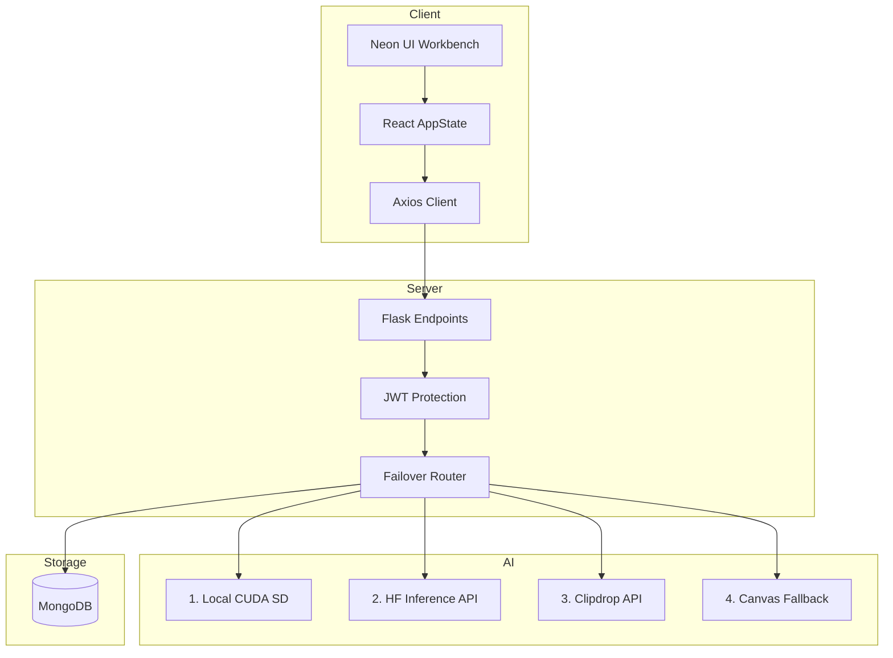

# 🎨 PictoAI — AI-Powered Art Generation Platform

<p align="center">
  
  
  
  
  
</p>

**PictoAI** is an AI-powered art generation platform built with React, Flask, and Stable Diffusion, featuring automatic failover routing, prompt caching, and Razorpay subscription checkouts.

[](screenshots/homepage.png)
*Click to expand application landing view*

### 💡 Why I Built This
I built PictoAI to explore production-grade AI application development beyond simple model inference by combining authentication, payments, caching, failover routing, and a complete frontend experience.

---

### 📊 Project Statistics

* **Stack**: React (Vite) + Flask Full Stack
* **Auth**: JWT Session Protection (Flask-JWT-Extended)
* **AI Pipelines**: Multi-Provider Routing (4 Failover Tiers)
* **Database**: MongoDB
* **Payments**: Razorpay checkout integration
* **Testing**: End-to-End API Integration tests
* **Resiliency**: DB-Offline local sandbox fallback mode

---

## 📸 Screenshots

| 🌟 Workspace (Generated State) | ⚙️ Workbench (Empty State) |
|:---:|:---:|
| [](screenshots/workspace_generated.png) | [](screenshots/workspace_empty.png) |
| *Click to enlarge* | *Click to enlarge* |

---

## 🚀 Live Demo & Links

* **Live Demo**: Local sandbox supported.
* **Demo Video**: Walkthrough video available upon request.
* **Sandbox Mode**: Automatically boots into offline sandbox simulator if local databases or API keys are missing.

---

## ⚡ Key Engineering Highlights

* **✅ Multi-provider AI inference**: Automatic failover routing that sequentially tries local GPU pipelines, Hugging Face cloud APIs, and Clipdrop before returning styled canvas fallbacks.
* **✅ MD5 prompt hashing**: Eliminates redundant GPU compute and API limits by hashing prompts and checking database caches first.
* **✅ JWT authentication**: Secure access tokens with bcrypt password hashing.
* **✅ Razorpay subscription workflow**: Fully integrated checkout workflows driven by signature-verified transaction event webhooks.
* **✅ Integration testing**: End-to-end regression validation suites (`test_endpoints.py`) to verify critical API paths.
* **✅ Offline sandbox mode**: Automated database-connectivity checkers enabling recruiter testing without active Mongo clusters.

---

## 🛠 Tech Stack & Developer Role

### Technologies
* **Frontend**: React, Vite, Axios, HSL CSS Themes
* **Backend**: Flask, Flask-JWT-Extended, PyMongo, Pillow (PIL)
* **AI Inference**: Stable Diffusion, Hugging Face, Clipdrop
* **Database**: MongoDB
* **Payments**: Razorpay Gateway

### 👨‍💻 Role
**Sole Developer** responsible for complete software architecture, API design, database schemas, frontend state contexts, failover routing logic, webhook receivers, testing, and sandbox configurations.

---

## ✨ Features

* **Multi-Provider Generation**: Try local GPU diffusers first, then cloud fallbacks.
* **Granular Options**: Custom art styles (Cyberpunk, Anime), aspect ratios, and prompt strengths.
* **Prompt Caching**: Match prompt hashes to serve cached images instantly.
* **Credit Purchases**: Multi-tier credit purchasing flows backed by Razorpay.
* **History drawers**: UI persistence showing recent creations surviving page reloads.

---

## 🧠 System Architecture Diagram



---

## 📁 Folder Structure

```text
pictoai-ai-image-generation/
├── client/                 # React Frontend (Vite)
├── server/                 # Flask Backend & AI routes
├── docs/                   # Extended API documentation
├── screenshots/            # Showcase interface images
├── .env.example            # Root environment variables configuration template
├── LICENSE                 # MIT License file
└── README.md               # Main developer guide
```

---

## 🧠 Engineering Challenges & Core Solutions

### 1. Handling Long and Flaky AI Inference Times
* **Challenge**: Local diffusion inference is computationally expensive, while cloud APIs are prone to rate limits, timeouts, and network failures.
* **Solution**: Developed a sequential failover pipeline in the AI router. When local GPUs are unavailable or cloud APIs fail, the backend catches the error and executes alternative endpoints, significantly improving reliability during provider failures.

### 2. Eliminating Redundant GPU Inference
* **Challenge**: Users entering the exact same prompts with matching aspect ratios repeatedly drain API limits and overload servers.
* **Solution**: Generated MD5 hashes of prompt, style, model, and aspect parameters. Duplicate hashes serve the pre-rendered image path directly from MongoDB, returning results almost instantly.

### 3. Verification of Multi-Provider Binary Payloads
* **Challenge**: Failover APIs can succeed but return truncated or corrupted binary packages.
* **Solution**: Integrated Pillow (PIL) image verification on incoming bytes, validating file structures before storage or credit subtraction.

---

## 💡 Lessons Learned

* **Fault-Tolerant Architectures**: Designing robust sequential failovers ensuring high reliability.
* **Authentication Security**: Protecting billing features using cryptographically signed JWT tokens and salted bcrypt hashes.
* **Latency Management**: Implementing metadata caching algorithms to bypass heavy inference pipelines.
* **Signature Verification**: Developing secure backend listeners to process financial status updates from third-party payment gateways.

---

## 🔌 REST API Overview

Detailed request/response JSON schemas can be found in [docs/API.md](file:///d:/Project/PICTOAI-main/docs/API.md).

| Method | Endpoint | Auth | Description |
|:---|:---|:---:|:---|
| POST | `/api/auth/register` | No | Register new user account |
| POST | `/api/auth/login` | No | Authenticate user and issue JWT |
| GET | `/api/auth/credits` | Yes | Retrieve session balance & plans |
| POST | `/api/image/generate-image` | Yes | Run failover AI image generator |
| POST | `/api/image/upscale` | Yes | Request upscale simulation |
| POST | `/api/payment/create-order` | Yes | Generate Razorpay order details |
| POST | `/api/payment/verify` | Yes | Validate payment and activate plan |
| POST | `/api/payment/webhook` | No | Capture Razorpay transaction events |

---

## 🧪 Testing Coverage

The codebase contains end-to-end integration tests (located in [test_endpoints.py](file:///d:/Project/PICTOAI-main/server/test_endpoints.py)) verifying:
* API Endpoint path checks and HTTP codes.
* JWT secure routes access controls.
* Razorpay payment signature verifier outputs.
* Multi-provider fallback loops.
* MD5 hash caching matches.

Execute tests locally with:
```bash
python server/test_endpoints.py
```

---

## 🚀 Deployment Ready Configuration

Designed with modular controllers, provider abstraction, and stateless REST APIs to support future horizontal scaling.

* **Frontend**: Vercel (static production build)
* **Backend**: Render (Gunicorn production WSGI server)
* **Database**: MongoDB Atlas cloud cluster
* **Payments**: Razorpay Gateway environment keys
* **Environment Variables**: Managed securely via GitHub Secrets and provider environment configuration panels

---

## 🗺 Future Roadmap

- [ ] **Docker Containers**: Combine client, server, and DB in a single `docker-compose` definition.
- [ ] **Redis Memory Caching**: Relieve MongoDB connections by mapping credit checking to Redis.
- [ ] **Asynchronous Workers**: Shift long-running local GPU Stable Diffusion executions to Celery.
- [ ] **Content Classification**: Hook prompt fields to lightweight CLIP-NSFW filters.

---

## ⚙️ Local Setup Instructions

See the detailed configuration steps in the [Local Setup section](file:///d:/Project/PICTOAI-main/README.md#1-backend-configuration) or refer to [.env.example](file:///d:/Project/PICTOAI-main/server/.env.example).

---

## 📄 License
This project is licensed under the **MIT License** - see the [LICENSE](file:///d:/Project/PICTOAI-main/LICENSE) file for details.
